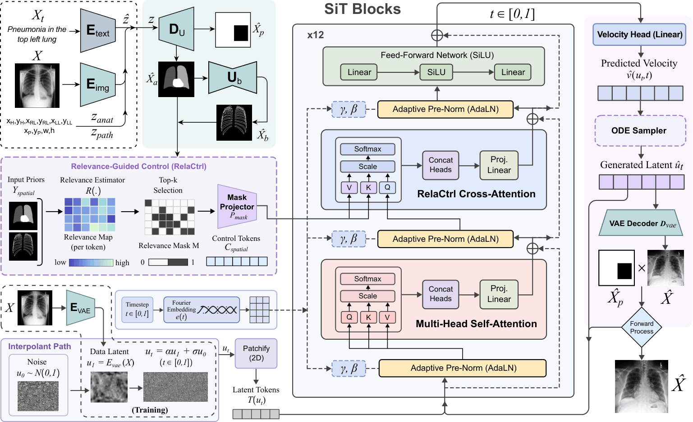

# LatAlignCXR: Latent-Aligned Scalable Interpolant Transformer for Controllable Chest X-ray Synthesis

---

## Abstract

Controllable chest X-ray (CXR) synthesis requires control over both semantic findings and their spatial relationship to thoracic anatomy. Text-conditioned generative models can specify disease labels or report-level descriptions, but often provide limited control over anatomical location and lesion extent. We propose **LatAlignCXR**, a latent-aligned framework for controllable CXR synthesis using a Scalable Interpolant Transformer (SiT) backbone. Text prompts, reference radiographs, and user-specified coordinates are mapped into a common structured latent representation that encodes anatomical layout, pathology location, and residual appearance variation. A latent-to-spatial decoder transforms this representation into anatomical, pathology, and thoracic structural priors, which condition the SiT backbone during generation. This formulation supports text-, image-, and coordinate-conditioned synthesis through a shared control interface.

---

## Framework Overview

<p align="center">
  
</p>

LatAlignCXR maps text prompts, reference radiographs, or user-specified coordinates into a shared **structured latent control space**:

$$z = [z_{\text{anat}}, z_{\text{path}}, z_{\text{attr}}] \in \mathbb{R}^{14}$$

| Component | Dimension | Description |
|-----------|:---------:|-------------|
| $z_{\text{anat}}$ | 6 | Anatomical coordinates: heart, right lung, and left lung centers |
| $z_{\text{path}}$ | 4 | Pathology location and extent: center $(x_P, y_P)$, width $(w_P)$, and height $(h_P)$ |
| $z_{\text{attr}}$ | 4 | Residual appearance variation (sampled from learned posterior) |

A latent-to-spatial decoder $D_{\text{lat}}$ transforms $z$ into interpretable spatial priors $(\hat{X}_a, \hat{X}_p, \hat{X}_b)$ representing anatomical, pathology, and thoracic structural channels. These priors condition the SiT backbone via additive token injection and Relevance-Guided Control (RelaCtrl) cross-attention.

---

## Key Features

- **Unified Multi-Modal Conditioning:** Text, image, and coordinate inputs are mapped into the same structured latent space via dedicated encoders ($E_{\text{text}}$, $E_{\text{img}}$).
- **Structured Latent Control Space:** Separates anatomical layout, pathology location/extent, and residual appearance into interpretable factors.
- **Latent-to-Spatial Decoder:** A CNN upsampling network converts latent codes into spatial priors without image-dependent skip connections, allowing application to text-derived, image-derived, or manually specified latent codes.
- **SiT-Based Generative Backbone:** Scalable Interpolant Transformer with velocity-matching in VAE latent space.
- **Relevance-Guided Control (RelaCtrl):** Token-level relevance estimation with top-$k$ selection for focused spatial cross-attention.
- **Severity-Conditioned Counterfactual Editing:** Modulate pathology severity while preserving patient-specific anatomy via partial-noise initialization.

---

## Setup

### 1. Clone the Repository

```bash
git clone https://github.com/nubcico/XrayGen.git
cd XrayGen
```

### 2. Environment Installation

```bash
conda env create -f environment.yaml
conda activate lataligncxr
```

Alternatively, install dependencies manually:

```bash
pip install -r requirements.txt
```

### 3. Download Pretrained Weights

Model checkpoints are available to credentialed researchers upon request, subject to MIMIC-CXR data use agreements. Place weights in the `checkpoints/` directory:

```text
checkpoints/
├── vae/                  # VAE encoder (E_vae) & decoder (D_vae)
├── latent_module/        # E_img, E_text, D_lat
├── sit_backbone/         # SiT velocity model (v_theta)
└── clip/                 # fine-tuned LongCLIP-L + single-layer MLP
```

---

## Inference

LatAlignCXR supports multiple inference modes that differ only in how the structured latent code $z$ is obtained.

### Text-to-Image Synthesis

Generate a CXR from a clinical text prompt. The prompt is embedded via frozen CLIP and mapped through $E_{\text{text}}$ to predict anatomical and pathology coordinates.

```bash
python generate.py --mode text \
                   --prompt "Pneumonia in the upper left lung" \
                   --output_dir "generated_xrays" \
                   --num_samples 4 \
                   --seed 42
```

### Image-to-Image Synthesis

Generate a CXR aligned with a reference radiograph. The reference is encoded via $E_{\text{img}}$ into the full structured latent space (including attribute posterior).

```bash
python generate.py --mode image \
                   --reference "resources/reference_cxr.png" \
                   --output_dir "generated_xrays" \
                   --num_samples 4 \
                   --seed 42
```

### Coordinate-to-Image Synthesis

Generate a CXR from explicitly specified anatomical and pathology coordinates.

```bash
python generate.py --mode coordinates \
                   --anat_coords "0.48,0.45,0.35,0.40,0.62,0.40" \
                   --path_coords "0.60,0.30,0.12,0.15" \
                   --output_dir "generated_xrays" \
                   --num_samples 4 \
                   --seed 42
```

### Controlled Generation with Spatial Priors

Condition on pre-computed anatomical and thoracic structural maps:

```bash
python generate.py --mode spatial \
                   --anatomic_map "resources/anatomical_map_1.png" \
                   --bone_map "resources/bone_mask_1.png" \
                   --output_dir "generated_xrays"
```

### Uncontrolled Generation

Generate without spatial conditioning (null-text embedding, prior-sampled $z_{\text{attr}}$):

```bash
python generate.py --mode unconditional \
                   --output_dir "generated_xrays" \
                   --num_samples 8
```

---

## Severity-Conditioned Counterfactual Editing

Modulate pathology severity while preserving patient-specific thoracic anatomy. The source radiograph is partially noised and re-integrated under fixed anatomical conditioning with a target severity level $s \in [0, 1]$.

```bash
python counterfactual_edit.py \
    --source "resources/original_xray_1.png" \
    --severity 0.8 \
    --edit_strength 0.85 \
    --output_dir "counterfactual_outputs"
```

Generate a severity progression sequence:

```bash
python counterfactual_edit.py \
    --source "resources/original_xray_1.png" \
    --severity_sweep "0.0,0.2,0.4,0.6,0.8,1.0" \
    --edit_strength 0.85 \
    --output_dir "counterfactual_progression"
```

*Note: Counterfactual outputs are severity-conditioned synthetic samples, not observed longitudinal follow-up images.*

---

## Training

*Note: The full training pipeline will be released upon publication.*

### Stage 1: Latent Module

The image encoder $E_{\text{img}}$ and latent-to-spatial decoder $D_{\text{lat}}$ are trained jointly:

```bash
python train_latent_module.py \
    --data_root /path/to/mimic_cxr \
    --epochs 200 \
    --lr 1e-4 \
    --weight_decay 1e-5 \
    --batch_size 64 \
    --gpus 8
```

The text-to-latent regressor $E_{\text{text}}$ (frozen CLIP + MLP):

```bash
python train_text_regressor.py \
    --data_root /path/to/mimic_cxr \
    --lr 1e-5 \
    --clip_model "ViT-B/32"
```

### Stage 2: SiT Backbone

Velocity-matching objective in VAE latent space:

```bash
python train_sit.py \
    --data_root /path/to/mimic_cxr \
    --config configs/sit_default.yaml \
    --lr 1e-4 \
    --optimizer adamw \
    --gpus 8
```

*Hardware: All experiments were conducted on 8x NVIDIA RTX 4090 GPUs.*

---

## Dataset

| Dataset | Size | Access |
|---------|------|--------|
| **MIMIC-CXR v2.0.0** (training) | 218,131 frontal images | [PhysioNet](https://doi.org/10.13026/C2JT1Q) (credentialing required) |
| **Indiana University CXR** (evaluation) | Open-i collection | [Kaggle](https://www.kaggle.com/datasets/raddar/chest-xrays-indiana-university) (CC BY-NC-ND 4.0) |

- Images are resized to 256x256 and normalized to zero mean and unit variance.
- Patient-level splits: 80/10/10 (train/val/test).
- Structured supervision is constructed from a curated subset of 20,000 frontal images with pathology labels.

---

## Acknowledgements and References

This work builds upon the following projects:

- [Scalable Interpolant Transformers (SiT)](https://github.com/willisma/SiT) - Ma et al., ECCV 2024
- [Latent Diffusion Models / Stable Diffusion](https://github.com/CompVis/stable-diffusion) - Rombach et al., CVPR 2022
- [ControlNet](https://github.com/lllyasviel/ControlNet) - Zhang et al., ICCV 2023
- [TorchXRayVision](https://github.com/mlmed/torchxrayvision) - Cohen et al., MIDL 2022
- [RAD-DINO](https://rdcu.be/fu9nH) - Perez-Garcia et al., Nature Machine Intelligence 2025
- [MIMIC-CXR](https://physionet.org/content/mimic-cxr/2.0.0/) - Johnson et al., 2019

---

## License

This project is released for research purposes only. Model checkpoints and pretrained weights are provided to credentialed researchers upon request, subject to MIMIC-CXR data use agreements.

---

## Contact

| Author | Email |
|--------|-------|
| Isabella Schlattner | isabella.schlattner@nu.edu.kz |
| Vadim Atlassov | vadim.atlassov@nu.edu.kz |
| Azimzhan Abdrakhmanov | azimzhan.abdrakhmanov@nu.edu.kz |
| Dong-Ok Won | dongok.won@hallym.ac.kr |
| Minho Lee | minho.lee@nu.edu.kz |

Department of Computer Science, Nazarbayev University, Astana, Kazakhstan
